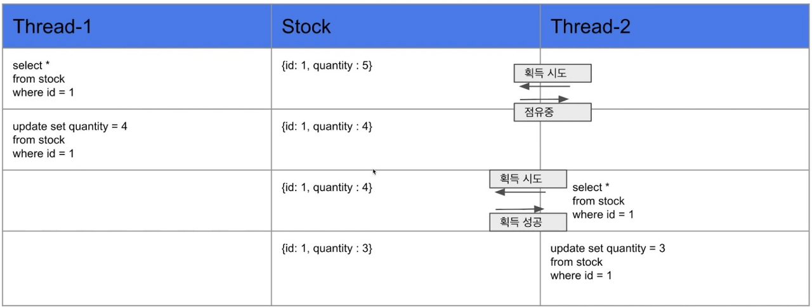
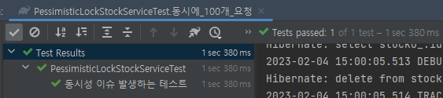
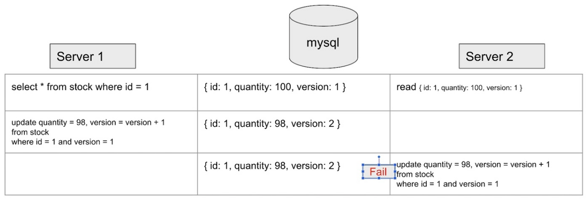
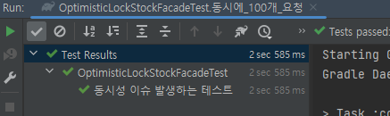

# 동시성을 해결하는 다양한 방법과 Redis의 분산락
[재고시스템으로 알아보는 동시성 이슈 해결방법](https://www.inflearn.com/course/%EB%8F%99%EC%8B%9C%EC%84%B1%EC%9D%B4%EC%8A%88-%EC%9E%AC%EA%B3%A0%EC%8B%9C%EC%8A%A4%ED%85%9C)
정리 레포

## 테스트 환경
- Java 17, Spring, JPA, Lombok
- JUnit5
- h2, Redis

## 제고시스템 로직
Entity
```java
@Entity
@Getter
@NoArgsConstructor(access = AccessLevel.PROTECTED)
public class Stock {

    @Id
    @GeneratedValue(strategy = GenerationType.AUTO)
    private Long id;
    private Long productId;
    private Long quantity;

    public Stock(final Long id, final Long quantity) {
        this.id = id;
        this.quantity = quantity;
    }

    public void decrease(final Long quantity) {
        if (this.quantity - quantity < 0) {
            throw new RuntimeException("재고 부족");
        }
        this.quantity -= quantity;
    }

}
```
Service
```java
@Service
public class StockService {
    private final StockRepository stockRepository;
    
    public StockService(final StockRepository stockRepository) {
        this.stockRepository = stockRepository;
    }

    @Transactional
    public void decrease(Long id, Long quantity) {
        Stock stock = stockRepository.findById(id).orElseThrow();
        stock.decrease(quantity);
        stockRepository.saveAndFlush(stock);
    }
}
```
Repository

```java
public interface StockRepository extends JpaRepository<Stock, Long> {
}
```

## 동시성을 고려하지 않을 때 문제점

```java

import static org.assertj.core.api.Assertions.assertThat;
import static org.junit.jupiter.api.Assertions.*;

@SpringBootTest
public class StockServiceTest {

    @Test
    @DisplayName("동시성 이슈 발생하는 테스트")
    void 동시에_100개_요청() throws InterruptedException {
        int threadCount = 100;
        // 비동기를 이용하는 작업을 단순하게 활용할 수 있는 javaAPI
        final ExecutorService executor = Executors.newFixedThreadPool(32);
        // 다른 스레드에서 수행중인 작업을 완료할때 대기할 수 있도록 도와주는 클래스
        final CountDownLatch latch = new CountDownLatch(threadCount);

        for (int i = 0; i < threadCount; i++) {
            executor.submit(() -> {
                try {
                    stockService.decrease(1L, 1L);
                } finally {
                    latch.countDown();
                }
            });
        }

        latch.await();
        final Stock stock = stockRepository.findById(1L).orElseThrow();
        assertThat(stock.getQuantity()).isEqualTo(0L);
    }
}

```
productId 1인 제품의 수량을 100개 세팅하고 ExecutorService를 통해 32개 스레드 풀을
생성하여 멀티스레드 테스트를 수행 하였습니다.

하지만 위로직을 수행했을 때 전혀 다른 결과가 나옵니다.


수량 100개의 수량을 가진 제품을 감소하는 로직을 1개 씩 100번 수행 하도록한 테스트 
였는데 결과를 0을 기대했지만 많은 수량이 남았다는 결과가 나옵니다.

이유는 무엇일까 ?
- 두 개이상의 스레드가 공유자원에 동시에 작업을 수행하려고 했기때문이다.
- race condition을 해결 하기 위해선 공유 자원에 대해 하나의 스레드에서 작업을 완료한 후 다른 스레드에서 접근하게 해야한다. 


## 해결방법

### 1. `synchronized`키워드를 활용
```java
@Service
public class StockService {
    ...
    
    
    @Transactional
    public synchronized void decrease(Long id, Long quantity) {
        Stock stock = stockRepository.findById(id).orElseThrow();
        stock.decrease(quantity);
        stockRepository.saveAndFlush(stock);
    }
}
```

Java의 synchronized 키워드를 사용해서 하나의 쓰레드씩 해당 메소드를 호출하도록 수정하였습니다.

하지만 정상적으로 동작하지 않았습니다.


이유는
- `@Transactiional`은 기본적으로 proxy를 이용하여 aop를 적용하기 때문이다.
-  Proxy가 (Commit)종료되기 전에 다른 쓰레드가 해당 자원에 접근할 수 있기 때문에 실제 데이터베이스의 값은 변경되지 않았을 수 있습니다.

#### 해결 방법
- `@Transactional` 어노테이션을 제거하면 된다.


#### synchronized 키워드의 문제점
- `Java`의 `Sychronized`는 하나의 프로세스 안에서만 보장이 됩니다.
- 즉, 서버가 1대일 때는 문제가 없지만 서버가 여러 대 일경우 여러 개의 인스턴스가 존재하는 것과 동일하기 때문에 실질적인 운영 환경에서는 데이터의 정합성을 보장할 수 없습니다.


### 2. Pessimistic Lock




#### 장점
- 충돌이 빈번하게 일어난다면 롤백의 횟수를 줄일 수 있기 때문에, Optimistic Lock 보다는 성능이 좋을 수 있습니다.
- 비관적 락을 통해 데이터를 제어하기 때문에 데이터 정합성을 어느정도 보장할 수 있습니다.

#### 단점
- 데이터 자체에 별도의 락을 잡기때문에 동시성이 떨어져 성능저하가 발생할 수 있습니다.
- 특히 읽기가 많이 이루어지는 데이터베이스의 경우에는 손해가 더 크다고 합니다.
- 서로 자원이 필요한 경우, 락이 걸려있으므로 데드락이 일어날 가능성이 있습니다.


### 3. Optimistic Lock
version을 이용하여 데이터 정합성을 맞춥니다.



- 서버1과 서버2가 버전1인 데이터를 가져갑니다.
- 서버1이 버전1을 업데이트할 때 버전2로 업데이트합니다.
- 서버2가 버전 1인 조건으로 업데이트를 실행할 때 실패하게 됩니다.
- 내가 읽은 버전이 수정 되었을 때 어플리케이션에서 다시 읽은 후에 작업을 수행합니다.


#### 장점
- 별도의 락을 잡지 않아서 Pessimistic Lock보다 성능상이점이 있다.

#### 단점
- update에 실패했을 때 개발자가 직접 실패로직을 짜야한다.
- 충돌이 빈번히 일어난다면 Pessimistic Lock을 이용하는 것을 추천

### 4. Named Lock
예제에서는 편의성을 위해서 Stock 엔티티를 사용하지만, 실무에서는 별도의 JDBC 를 사용해야 한다고 합니다.
```java
public interface LockRepository extends JpaRepository<Stock, Long> {

    @Query(value = "select get_lock(:key, 3000)", nativeQuery = true)
    void getLock(String key);

    @Query(value = "select release_lock(:key, key)", nativeQuery = true)
    void releaseLock(String key);
}
```

Named Lock 사용시 주의사항

- 예제에서는 동일한 DataSource 를 사용하지만, 실제 서비스에서는 커넥션풀이 부족해질 수 있기에 DataSoruce 를 분리하는 걸 추천한다고 합니다.

#### 장점

- NamedLock 은 주로 분산락을 구현할 때 사용합니다.
- Pessimistic 락은 time out을 구현하기 굉장히 힘들지만, Named Lock은 비교적 손쉽게 구현할 수 있다고 합니다.
- 그 외에, 데이터 정합성을 맞춰야하는 경우에도 사용할 수 있다고 합니다.

#### 단점
- Naemd Lock 은 트랜잭션 종료 시에, 락 해제와 세션관리를 잘 해주어야하므로 주의해서 사용주어야 합니다.
- 실제 사용할 때는 구현방법이, 복잡할 수 있습니다.


## Redis

### Lettuce 
```java
@Component
public class RedisRepository {
    public Boolean lock(Long key) {
        return redisTemplate.opsForValue()
            .setIfAbsent(generateKey(key), "lock", Duration.ofMillis(3_000));
    }

    public Boolean unLock(Long key) {
        return redisTemplate.delete(generateKey(key));
    }
}
```
- Lettuce은 MySQL과 비슷한 락 방식입니다.
- key를 활용하여 락을 획득하고 로직이 끝나면 unlock메서드를 활용하여 락을 해제합니다.
- lettuce lock같은 경우 개발자가 락획득에 대한 로직을 구현해야 됩니다.

#### 주의 사항
- 스핀락 방식임으로 레디스의 부하를 줄수 있습니다.
- 레디스 락을 획득 시 Thread.sleep으로 텀을 두고 사용해야 합니다.

### Redisson
- pub-sub 기반으로 Lock 구현 제공합니다.
- 별도의 retry 로직이 필요없다.
- 채널을 하나 만들고 락을 점유하고 있는 쓰레드가 락을 받으려는 쓰레드에게 점유 해제를 알린다. 
```java
@Component
public class RedissonLockStockFacade {

    // 구현이 복잡하고, 별도의 라이브러리를 사용해야 함
    private final RedissonClient redissonClient;
    private final StockService stockService;

    public RedissonLockStockFacade(final RedissonClient redissonClient,
        final StockService stockService) {
        this.redissonClient = redissonClient;
        this.stockService = stockService;
    }

    public void decrease(Long key, Long quantity) {
        final RLock lock = redissonClient.getLock(key.toString());

        try {
            final boolean available = lock.tryLock(5, 1, TimeUnit.SECONDS);

            if (!available) {
                System.out.println("lock 획득 실패 @!");
                return;
            }
            stockService.decrease(key, quantity);
        } catch (InterruptedException e) {
            throw new RuntimeException(e);
        } finally {
            lock.unlock();
        }
    }
}
```
## MySQL과 Redis 간단 비교
### MySQL
- 이미 데이터베이스로 MySQL를 사용하고 있다면 별도의 비용없이 사용이 가능
- 어느정도의 트래픽까지는 문제없이 활용 가능
- Redis보다는 성능이 좋지 않다.
### Redis
- 활용중인 Redis가 없다면 별도로 구축해야하기 때문에 인프라 관리비용이 발생
- MySQL보다 성능이 좋음
- 