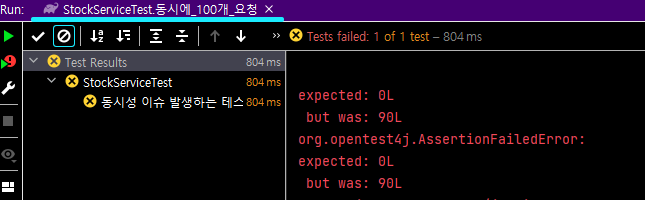
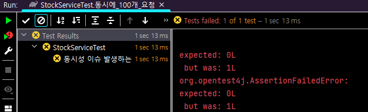
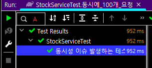

# 동시성을 해결하는 다양한 방법과 Redis의 분산락
[재고시스템으로 알아보는 동시성 이슈 해결방법](https://www.inflearn.com/course/%EB%8F%99%EC%8B%9C%EC%84%B1%EC%9D%B4%EC%8A%88-%EC%9E%AC%EA%B3%A0%EC%8B%9C%EC%8A%A4%ED%85%9C)
정리 레포

## 테스트 환경
- Java 17, Spring, JPA, Lombok
- JUnit5
- h2, Redis

## 제고시스템 로직
Entity
```java
@Entity
@Getter
@NoArgsConstructor(access = AccessLevel.PROTECTED)
public class Stock {

    @Id
    @GeneratedValue(strategy = GenerationType.AUTO)
    private Long id;
    private Long productId;
    private Long quantity;

    public Stock(final Long id, final Long quantity) {
        this.id = id;
        this.quantity = quantity;
    }

    public void decrease(final Long quantity) {
        if (this.quantity - quantity < 0) {
            throw new RuntimeException("재고 부족");
        }
        this.quantity -= quantity;
    }

}
```
Service
```java
@Service
public class StockService {
    private final StockRepository stockRepository;
    
    public StockService(final StockRepository stockRepository) {
        this.stockRepository = stockRepository;
    }

    @Transactional
    public void decrease(Long id, Long quantity) {
        Stock stock = stockRepository.findById(id).orElseThrow();
        stock.decrease(quantity);
        stockRepository.saveAndFlush(stock);
    }
}
```
Repository

```java
public interface StockRepository extends JpaRepository<Stock, Long> {
}
```

## 동시성을 고려하지 안흘 때 문제점

```java

import static org.assertj.core.api.Assertions.assertThat;
import static org.junit.jupiter.api.Assertions.*;

@SpringBootTest
public class StockServiceTest {

    @Test
    @DisplayName("동시성 이슈 발생하는 테스트")
    void 동시에_100개_요청() throws InterruptedException {
        int threadCount = 100;
        // 비동기를 이용하는 작업을 단순하게 활용할 수 있는 javaAPI
        final ExecutorService executor = Executors.newFixedThreadPool(32);
        // 다른 스레드에서 수행중인 작업을 완료할때 대기할 수 있도록 도와주는 클래스
        final CountDownLatch latch = new CountDownLatch(threadCount);

        for (int i = 0; i < threadCount; i++) {
            executor.submit(() -> {
                try {
                    stockService.decrease(1L, 1L);
                } finally {
                    latch.countDown();
                }
            });
        }

        latch.await();
        final Stock stock = stockRepository.findById(1L).orElseThrow();
        assertThat(stock.getQuantity()).isEqualTo(0L);
    }
}

```
productId 1인 제품의 수량을 100개 세팅하고 ExecutorService를 통해 32개 스레드 풀을
생성하여 멀티스레드 테스트를 수행 하였습니다.

하지만 위로직을 수행했을 때 전혀 다른 결과가 나옵니다.


수량 100개의 수량을 가진 제품을 감소하는 로직을 1개 씩 100번 수행 하도록한 테스트 
였는데 결과를 0을 기대했지만 많은 수량이 남았다는 결과가 나옵니다.

이유는 무엇일까 ?
- 두 개이상의 스레드가 공유자원에 동시에 작업을 수행하려고 했기때문이다.
- race condition을 해결 하기 위해선 공유 자원에 대해 하나의 스레드에서 작업을 완료한 후 다른 스레드에서 접근하게 해야한다. 


## 해결방법

### `synchronized`키워드를 활용
```java
@Service
public class StockService {
    ...
    
    
    @Transactional
    public synchronized void decrease(Long id, Long quantity) {
        Stock stock = stockRepository.findById(id).orElseThrow();
        stock.decrease(quantity);
        stockRepository.saveAndFlush(stock);
    }
}
```

Java의 synchronized 키워드를 사용해서 하나의 쓰레드씩 해당 메소드를 호출하도록 수정하였습니다.

하지만 정상적으로 동작하지 않았습니다.


이유는
- `@Transactiional`은 기본적으로 proxy를 이용하여 aop를 적용하기 때문이다.
-  Proxy가 (Commit)종료되기 전에 다른 쓰레드가 해당 자원에 접근할 수 있기 때문에 실제 데이터베이스의 값은 변경되지 않았을 수 있습니다.

#### 해결 방법
- `@Transactional` 어노테이션을 제거하면 된다.



#### synchronized 키워드의 문제점
- `Java`의 `Sychronized`는 하나의 프로세스 안에서만 보장이 됩니다.
- 즉, 서버가 1대일 때는 문제가 없지만 서버가 여러 대 일경우 여러 개의 인스턴스가 존재하는 것과 동일하기 때문에 실질적인 운영 환경에서는 데이터의 정합성을 보장할 수 없습니다.
 